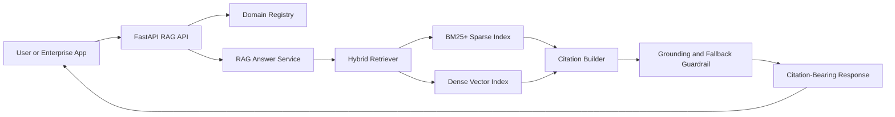
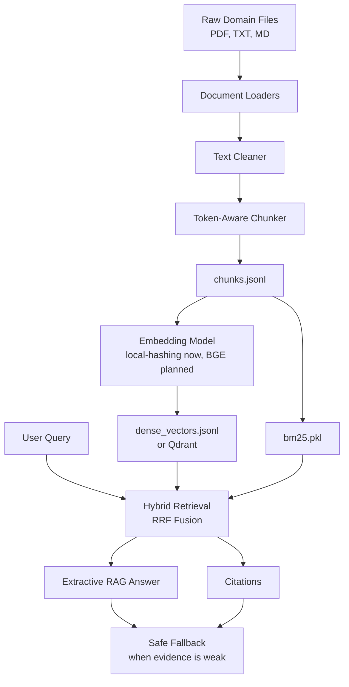
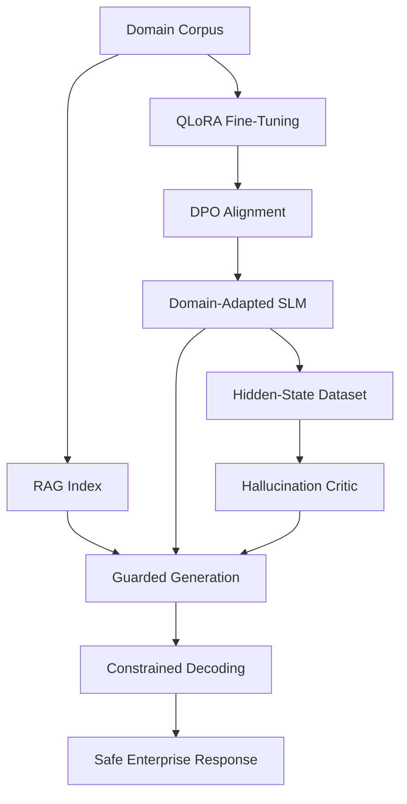

# Generic Domain SLM Guardrails

A production-oriented framework for building domain-specialized, citation-bearing, guardrailed Small Language Model (SLM) systems. The project is designed as a reusable core platform with `medical_prescription` as the first domain adapter.

The current implementation focuses on the Retrieval-Augmented Generation (RAG) foundation: document ingestion, chunking, hybrid retrieval, citation-bearing answers, fallback behavior, API serving, and an initial evaluation set. Future phases extend this into QLoRA fine-tuning, DPO alignment, hidden-state hallucination detection, and live guardrail enforcement.

## Project Description

Enterprises often want smaller, cheaper models that can answer narrow-domain questions accurately. The problem is that generic language models can hallucinate, especially in high-stakes domains such as medical prescription, legal compliance, finance, insurance, and internal policy.

This project builds a system that:

- Ingests domain documents such as PDFs, text files, and manuals.
- Converts documents into clean searchable chunks.
- Retrieves evidence using hybrid sparse plus dense search.
- Produces answers with explicit citations.
- Falls back safely when evidence is weak.
- Exposes a FastAPI interface for production integration.
- Tracks answer quality through an evaluation set.
- Prepares the architecture for future fine-tuning and hallucination critic phases.

The first adapter is `medical_prescription`, using public medical prescription and ICD-10-CM style source documents.

## Why This Project Is Needed

Most enterprise AI systems fail at one of three points:

1. They are too expensive because they depend only on large frontier models.
2. They are too generic because the model is not adapted to a narrow domain.
3. They are too risky because answers are not grounded in verifiable sources.

This project addresses those issues by combining:

- A smaller model strategy.
- Domain-specific retrieval.
- Citation-bearing responses.
- Evaluation-driven development.
- Future active hallucination guardrails.

The goal is not just to generate fluent answers. The goal is to make answers traceable, auditable, and safe enough for enterprise workflows.

## Current Status

Implemented:

- Generic domain registry.
- `medical_prescription` domain adapter.
- PDF, TXT, and Markdown ingestion.
- Text cleaning and chunking.
- BM25+ sparse retrieval with stemming.
- Local dense retrieval with hashing embeddings.
- Hybrid retrieval using Reciprocal Rank Fusion.
- Citation-bearing RAG response service.
- FastAPI `/health` and `/query` endpoints.
- Initial RAG evaluation dataset.
- Unit tests for registry, chunking, retrieval, RAG API, and evaluation.

Planned:

- Production embedding model integration.
- Qdrant-first vector search.
- Query rewriting and reranking.
- QLoRA fine-tuning.
- DPO alignment.
- Hidden-state hallucination critic.
- Live generation guardrail hook.
- Triton or high-throughput serving.

## Advanced DPO Architecture

- `DPOPreferenceGenerator`: generates high-quality preference pairs by pairing grounded, cited answers with deliberately weaker alternatives.
- `DPOTrainer`: performs adapter-based policy alignment using a reference SFT model and configurable DPO hyperparameters.
- `GroundednessComparator`: measures the real-world impact of alignment using objective grounding metrics and automated reporting.

This pipeline emphasizes DPO as a distinct alignment phase that teaches the model to prefer fact-supported, citation-backed outputs over vague or hallucinated answers while preserving domain knowledge from SFT.

## Tech Stack

### Implemented

| Layer | Technology | Purpose |
|---|---|---|
| Language | Python | Core implementation |
| API | FastAPI | Query endpoint and health check |
| Data format | JSONL | Chunks, local dense index, eval data |
| PDF parsing | PyMuPDF | Extract text from PDF documents |
| Sparse retrieval | Custom BM25+ | Fast keyword/code-based retrieval |
| Dense retrieval | Local hashing embeddings | Dependency-light semantic fallback |
| Hybrid retrieval | Reciprocal Rank Fusion | Merge sparse and dense evidence |
| Evaluation | Pytest + custom eval runner | Regression tests and RAG quality checks |
| Vector DB path | Qdrant wrapper | Production vector store integration |
| Container support | Docker Compose | Qdrant service setup |

### Planned For Later Phases

| Layer | Technology | Purpose |
|---|---|---|
| Base SLM | Llama-3-8B or Phi-3.5-mini | Domain-adapted generation |
| Training | PyTorch, Transformers | Model loading and training |
| Efficient tuning | PEFT, QLoRA, Unsloth | Low-cost domain fine-tuning |
| Preference alignment | TRL DPOTrainer | Align model toward grounded answers |
| Guardrail critic | PyTorch BiLSTM or 1D-CNN | Detect hallucination from hidden states |
| Constrained decoding | Outlines | JSON/schema-valid outputs |
| Production serving | Triton Inference Server | Dynamic batching and high throughput |

## Inputs

### Raw Domain Documents

The ingestion layer currently supports:

```text
.pdf
.txt
.md
```

Example folder:

```text
data/raw/medical_prescription/
```

Example documents:

```text
medical prescription manuals
ICD-10-CM guidelines
claims processing references
coding policy documents
internal billing SOPs
```

### API Query Input

```json
{
  "domain": "medical_prescription",
  "query": "When should modifier 25 be used?",
  "top_k": 3,
  "output_format": "answer_with_citations"
}
```

## Outputs

### API Response

```json
{
  "domain": "medical_prescription",
  "query": "When should modifier 25 be used?",
  "answer": "Modifier 25 is used to indicate that a significant, separately identifiable evaluation and management service was performed... [C1]",
  "citations": [
    {
      "citation_id": "C1",
      "chunk_id": "medical_prescription_sample_modifier_25_p0001_c001",
      "source_id": "sample_modifier_25",
      "page": 1,
      "score": 0.0328,
      "text": "Modifier 25 is used to indicate..."
    }
  ],
  "guardrail_status": {
    "rag_grounded": true,
    "json_valid": true,
    "fallback_used": false,
    "reason": null,
    "critic_score": 0.5803
  },
  "latency_ms": 123.45
}
```

### Fallback Response

When evidence is missing or weak:

```json
{
  "answer": "I could not verify this from the available source documents.",
  "citations": [],
  "guardrail_status": {
    "rag_grounded": false,
    "fallback_used": true,
    "reason": "no_retrieval_evidence"
  }
}
```

## Target Audiences

This project is useful for:

- AI/ML engineers building domain-adapted SLM systems.
- Healthcare technology teams working on medical prescription assistants.
- Compliance and audit teams that need source-grounded answers.
- Enterprise architects evaluating cheaper alternatives to large-model-only workflows.
- Researchers studying hallucination detection and guardrailed inference.
- Students building a strong applied AI portfolio project.

## Architecture Diagram



## Data Flow Diagram



## Planned Full System Flow



## Repository Structure

```text
domain_slm_guardrails/
  api/
    main.py          # FastAPI app
    rag.py           # Citation-bearing RAG answer logic
    schemas.py       # API request/response models
  core/
    config.py        # Base config loader
    domain_registry.py
  ingestion/
    loaders.py       # PDF/TXT/MD loaders
    cleaners.py      # Text cleanup
    chunkers.py      # Token-aware chunking
    pipeline.py      # End-to-end ingestion
  retrieval/
    bm25.py          # BM25+ sparse retrieval
    embeddings.py    # Hashing and sentence-transformer embeddings
    vector_store.py  # Local dense index and Qdrant wrapper
    hybrid.py        # RRF fusion and cached retriever
  evaluation/
    rag_eval.py      # Initial RAG evaluation runner
    groundedness_comparator.py  # DPO vs baseline groundedness comparator
  training/
    __init__.py      # QLoRA and DPO workflow package
    dpo_generator.py # Preference dataset generation for DPO
    dpo_trainer.py   # Adapter-based DPO training orchestration
  critic/
    __init__.py      # Placeholder for hallucination critic
```

Other important folders:

```text
configs/
domains/
scripts/
tests/
data/raw/
data/processed/
data/indexes/
data/evaluation/
docker/
docs/
```

## Quick Start

### 1. Ingest Documents

```bash
python scripts/ingest_domain.py --domain medical_prescription
```

This creates:

```text
data/processed/medical_prescription/chunks.jsonl
```

### 2. Build Indexes

Local mode:

```bash
python scripts/build_index.py --domain medical_prescription --no-qdrant
```

This creates:

```text
data/indexes/medical_prescription/bm25.pkl
data/indexes/medical_prescription/dense_vectors.jsonl
```

Qdrant mode:

```bash
docker compose -f docker/docker-compose.yml up -d
python scripts/build_index.py --domain medical_prescription
```

### 3. Query Retrieval

```bash
python scripts/query_retrieval.py --domain medical_prescription --query "When should modifier 25 be used?"
```

### 4. Run The API

```bash
uvicorn domain_slm_guardrails.api.main:app --reload --port 8000
```

Open:

```text
http://127.0.0.1:8000/docs
```

### 5. Query The API

```bash
curl -X POST http://127.0.0.1:8000/query \
  -H "Content-Type: application/json" \
  -d "{\"domain\":\"medical_prescription\",\"query\":\"When should modifier 25 be used?\",\"top_k\":3}"
```

### 6. Run Tests

```bash
python -m pytest
```

### 7. Run Initial RAG Evaluation

```bash
python scripts/run_rag_eval.py
```

Expected current result:

```text
total: 4
passed: 4
pass_rate: 1.0
```

## Main Files Responsible For RAG Quality

| File | Why It Matters |
|---|---|
| `domain_slm_guardrails/api/rag.py` | Converts retrieved evidence into citation-bearing answers and fallback responses |
| `domain_slm_guardrails/retrieval/hybrid.py` | Merges dense and sparse retrieval results |
| `domain_slm_guardrails/retrieval/bm25.py` | Handles exact keyword/code retrieval |
| `domain_slm_guardrails/retrieval/embeddings.py` | Controls semantic vector generation |
| `domain_slm_guardrails/retrieval/vector_store.py` | Stores and searches dense vectors |
| `domain_slm_guardrails/ingestion/chunkers.py` | Determines how much evidence each chunk contains |
| `data/evaluation/medical_prescription/rag_eval.jsonl` | Defines the first measurable RAG success cases |

## Implementation Roadmap

### Phase 1: Retrieval Foundation

Status: implemented.

- Ingest corpus.
- Clean text.
- Chunk documents.
- Build BM25 and dense indexes.
- Query hybrid retriever.

### Phase 2: RAG API Baseline

Status: implemented.

- FastAPI service.
- Citation-bearing answers.
- Grounding/fallback metadata.
- Initial evaluation set.

### Phase 3: Better Retrieval

Status: next.

- Real embedding model such as `BAAI/bge-large-en-v1.5`.
- Qdrant-first vector search.
- Query expansion for medical abbreviations.
- Cross-encoder reranking.
- Larger eval set.

### Phase 4: Model Fine-Tuning

Status: planned.

- Load Llama-3-8B or Phi-3.5-mini.
- Run QLoRA supervised fine-tuning.
- Mix domain data with general language samples.
- Save LoRA adapters.

### Phase 5: DPO Alignment

Status: planned.

- Generate chosen/rejected preference pairs.
- Train with TRL `DPOTrainer`.
- Evaluate groundedness and refusal behavior.

### Phase 6: Hallucination Critic

Status: planned.

- Capture hidden states from middle-to-late transformer layers.
- Label factual vs hallucinated tokens.
- Train lightweight BiLSTM or 1D-CNN probe.
- Estimate hallucination probability during generation.

### Phase 7: Live Guardrails And Production

Status: planned.

- Add custom generation guardrail hook.
- Add constrained JSON decoding.
- Add production monitoring.
- Benchmark hallucination rate, latency, JSON validity, and throughput.

## Future Enhancements

- Add more domains using the same domain registry pattern.
- Add licensed CPT material if available.
- Expand medical prescription eval from 4 cases to 100-300 cases.
- Add source-type filters and page-range filters.
- Add explainability metrics for retrieved chunks.
- Add streaming API responses.
- Add structured outputs for claim review and coding recommendation.
- Add deployment profiles for CPU, single GPU, and Triton.
- Add observability for latency, citation coverage, fallback rate, and retrieval hit rate.

## Current Verification Snapshot

The latest verified state:

```text
python -m pytest
11 passed
```

```text
python scripts/run_rag_eval.py
total: 4
passed: 4
pass_rate: 1.0
```

API smoke test:

```text
GET /health -> 200
POST /query -> 200
citations returned -> yes
guardrail_status.rag_grounded -> true
```
